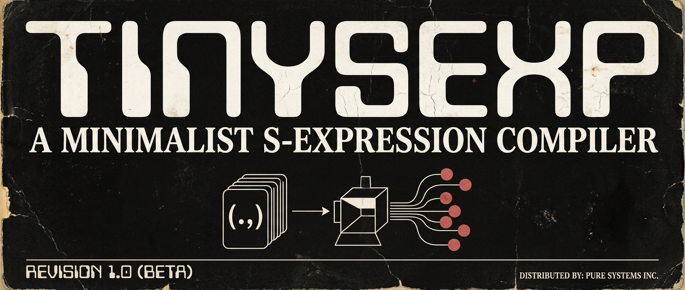

# tinysexp
`tinysexp` is a minimalist Lisp compiler that targets the x86-64 architecture. It takes Lisp source code written in a simple s-expression syntax and compiles it down to NASM-compatible x86 assembly code following the System V ABI.


## Features
A subset of Lisp, including:
### Arithmetic Operations
`+`,`-`,`*`,`/`
### Comparison Operations
`=`,`/=`,`>`,`<`,`>=`,`<=`
### Logical Operations
`and`,`or`,`not`
### Bitwise Operations
`logand`,`logior`,`logxor`,`lognor`
### Conditionals
`if`,`when`,`cond`
### Loop
`dotimes`,`loop`
### Functions
`defun`
### Variables
`let`,`setq`,`defvar`,`defconstant`
### Built-in Functions
`print`, `read-integer`, `read-double`, `read-string`

## Usage
```
➜  ~ tinysexp -h
OVERVIEW: Lisp compiler for x86-64 architecture

USAGE: tinysexp [options] file

OPTIONS:
  -o, --output          The output file name
  -h, --help            Display available options
  -v, --version         Display the version of this program
```
## Example
**Input**
```lisp
(defvar pi 3.1416)

(defun AreaOfCircle(radius)
    (let (area)
        (setq radius (* radius radius))
        (setq area (* pi radius))))

(print "Enter radius:")
(print (AreaOfCircle (read-integer)))
```
**Output**
```asm
extern _lrt_print_int
extern _lrt_print_double
extern _lrt_print_str
extern _lrt_read_int
extern _lrt_read_double
extern _lrt_read_str
section .text
    global _main
_main:
    push rbp
    mov rbp, rsp
    lea rdi, [rel str.0]
    call _lrt_print_str
    mov r10, rax
    call _lrt_read_int
    mov r10, rax
    mov rdi, r10
    call AreaOfCircle
    movsd xmm1, xmm0
    movsd xmm0, xmm1
    call _lrt_print_double
    movsd xmm1, xmm0
    xor eax, eax
    leave
    ret

AreaOfCircle:
    push rbp
    mov rbp, rsp
    sub rsp, 8
    mov qword [rbp - 8], rdi
    sub rsp, 8
    mov r10, qword [rbp - 8]
    mov r11, qword [rbp - 8]
    imul r10, r11
    mov qword [rbp - 8], r10
    movsd xmm1, qword [rel pi]
    mov r10, qword [rbp - 8]
    cvtsi2sd xmm2, r10
    mulsd xmm1, xmm2
    movsd qword [rbp - 16], xmm1
    add rsp, 8
    movsd xmm0, xmm1
    add rsp, 8
    leave
    ret

section .rodata
str.0: 
    db "Enter radius:", 10, 0

section .data
pi: 
    dq 0x400921FF20000000
```
## License
This project is licensed under the GPL-3.0 License. See the LICENSE file for details.
